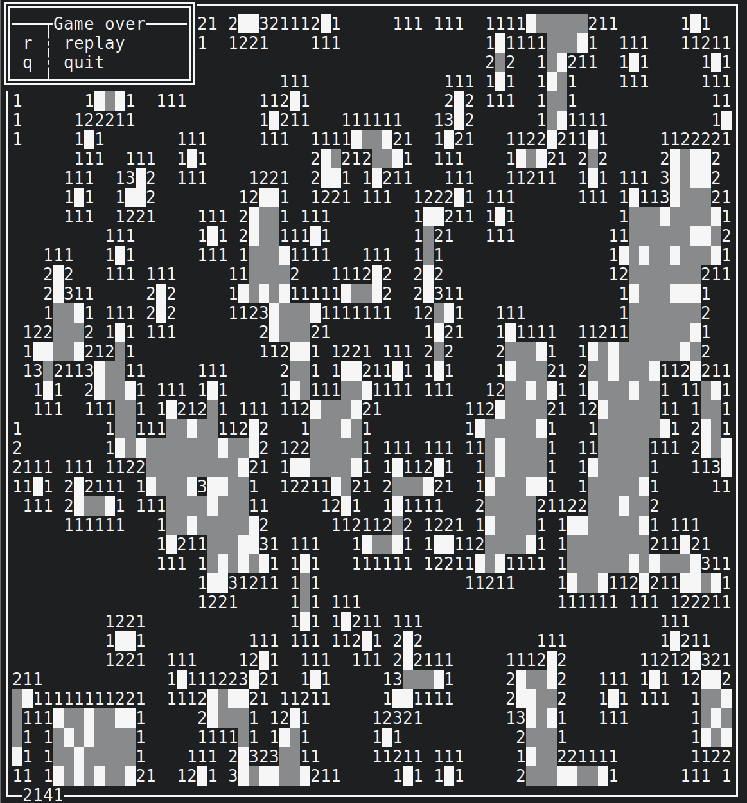

# Termion

Termion is a pure Rust, bindless library for low-level handling, manipulating
and reading information about terminals. This provides a full-featured
alternative to Termbox.

Termion aims to be simple and yet expressive. It is bindless, meaning that it
is not a front-end to some other library (e.g., ncurses or termbox), but a
standalone library directly talking to the TTY.

Supports Redox, Mac OS X, and Linux (or, in general, ANSI terminals).

[Documentation.](http://ticki.github.io/termion/termion/) | [Examples.](https://github.com/Ticki/termion/tree/master/examples)

## A note on stability

Although small breaking changes might happen, I will try my best to avoid them,
and this crate can generally be considered stable.

## Cargo.toml

For nightly, add

```toml
[dependencies.termion]
git = "https://github.com/ticki/termion"
```

For stable,

```toml
[dependencies.termion]
git = "https://github.com/ticki/termion"
default-features = false
```

## Features

- Raw mode.
- 256-color mode.
- Cursor movement.
- Color output.
- Calculating ANSI escapes.
- Text formatting.
- Console size.
- Control sequences.
- Termios control.
- Password input.
- Redox support.
- Panic-free error handling.
- Special keys events (modifiers, special keys, etc.).
- Allocation-free.
- Asynchronous key events.
- Carefully tested.

and much more.

## Example

```rust
extern crate termion;

use termion::{TermWrite, color, Style};

use std::io;

fn main() {
    let stdout = io::stdout();
    let mut stdout = stdout.lock();

    stdout.color(color::Red).unwrap();
    println!("Red");

    stdout.color(color::Blue).unwrap();
    println!("Blue");

    stdout.style(Style::Bold).unwrap();
    println!("Blue'n'Bold");

    stdout.reset().unwrap();
    stdout.style(Style::Italic).unwrap();
    println!("Just plain italic")
}
```

## Usage

See `examples/`, and the documentation, which can be rendered using `cargo doc`.

For a more complete example, see [a minesweeper implementation](https://github.com/redox-os/games-for-redox/blob/master/src/minesweeper/main.rs), that I made for Redox using termion.




## TODO

- Mouse input

## License

MIT/X11.
